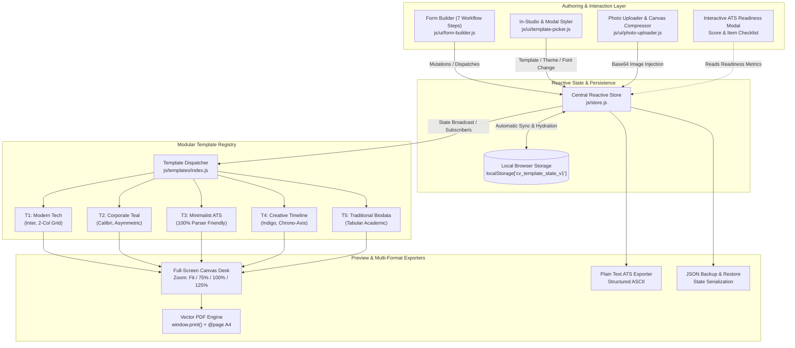

# System Architecture & Technical Specifications

> **CV Template** is a lightweight, zero-dependency, client-side document authoring studio engineered for ATS readability, vector print fidelity, and responsive ergonomics.

---

## 1. High-Level System Architecture

The following diagram illustrates the unidirectional data flow, reactive state synchronization, and modular subsystem interfaces:



---

## 2. Unidirectional Reactive State Architecture

All mutable document data is centralized in [`js/store.js`](js/store.js).

### Data Flow Lifecycle:
1. **User Action**: Form inputs emit `input` or `change` events.
2. **Action Dispatch**: Handlers call specific mutation methods on `store` (e.g., `store.updateBasics()`, `store.setTemplate()`, `store.addExperience()`).
3. **State Mutation**: The store creates an updated immutable snapshot of the state tree.
4. **Local Persistence**: The snapshot is serialized to `localStorage['cv_template_state_v1']` wrapped in `try/catch` defensive handlers.
5. **Subscriber Notification**: All active subscribers (the preview renderer, ATS index calculator, and template picker badges) are notified via callback execution.
6. **Virtual DOM Refresh**: The active template renderer compiles the new HTML and swaps the content into `#cv-paper`.

---

## 3. Core State Schema

The application state tree is defined as follows:

```typescript
interface CVState {
  selectedTemplate: 'template-1' | 'template-2' | 'template-3' | 'template-4' | 'template-5';
  themeColor: string; // Hex color code (e.g., '#0f766e')
  fontFamily: 'sans' | 'corporate' | 'serif' | 'mono';
  basics: {
    fullName: string;
    headline: string;
    photoUrl: string; // Base64 data URL or empty string
    photoShape: 'circle' | 'square';
    showPhoto: boolean;
    email: string;
    phone: string;
    location: string;
    website: string;
    linkedin: string;
    github: string;
  };
  summary: string;
  showSummary: boolean;
  skills: Array<{
    id: string;
    category: string;
    items: string[];
  }>;
  languages: Array<{
    id: string;
    name: string;
    proficiency: 'Native' | 'Fluent' | 'Professional Working' | 'Conversational' | 'Elementary';
  }>;
  experience: Array<{
    id: string;
    title: string;
    company: string;
    period: string;
    tag: string;
    bullets: string[];
    isCollapsed?: boolean;
  }>;
  education: Array<{
    id: string;
    degree: string;
    institution: string;
    year: string;
    score: string;
    isCollapsed?: boolean;
  }>;
  biodata: {
    fatherName: string;
    dob: string;
    nationality: string;
    gender: string;
    maritalStatus: string;
    address: string;
  };
  showBiodata: boolean;
  declaration: {
    enabled: boolean;
    text: string;
    place: string;
    date: string;
    signatureName: string;
  };
}
```

---

## 4. Modular Template Subsystem

Every template implementation in `js/templates/` conforms to a standard interface:

```javascript
/**
 * Render complete template markup from state.
 * @param {CVState} data
 * @returns {string} Fully compiled HTML string
 */
export function renderTemplate(data) { ... }
```

### Template Catalog Specifications:

| ID | Name | Role Alignment | ATS Score | Font Family | Structure |
|---|---|---|---|---|---|
| `template-1` | **Modern Tech** | Software Engineers, DevOps, Data Scientists | 98% | Sans (`Inter`) | 2-Column with Skills Category Grid |
| `template-2` | **Corporate Teal** | Executives, Directors, Operations Leads | 96% | Corporate (`Calibri`) | Asymmetric Sidebar with Executive Header |
| `template-3` | **Minimalist ATS** | Universal, High-Volume Job Applications | 100% | Sans / Serif | Pure Single-Column, Zero Graphics/Tables |
| `template-4` | **Creative Timeline** | Product Designers, Consultancies, Architects | 95% | Modern Sans (`Inter`) | Visual Chronological Vertical Axis |
| `template-5` | **Traditional Biodata** | Academic, Indian Civil/Corporate Portfolios | 94% | Clean Serif / Sans | Tabular Academic Marks & Particulars |

---

## 5. Vector-Sharp A4 Print Mechanics

Vector PDF generation is powered by browser-native `@page` print rules defined in [`css/print.css`](css/print.css):

```css
@page {
  size: A4 portrait;
  margin: 0mm;
}

@media print {
  html, body {
    width: 210mm;
    height: 297mm;
    margin: 0;
    padding: 0;
    background: #ffffff !important;
    -webkit-print-color-adjust: exact !important;
    print-color-adjust: exact !important;
  }

  /* Hide all studio UI, steppers, and toolbars */
  .app-header,
  .mobile-tabs,
  .editor-main-stage,
  .preview-modal-toolbar,
  .zoom-widget {
    display: none !important;
  }

  /* Position document at the root of the print page */
  #cv-paper {
    width: 210mm !important;
    min-height: 297mm !important;
    box-shadow: none !important;
    border: none !important;
    transform: none !important;
  }
}
```

### Key PDF Export Highlights:
- **Zero Rasterization**: Text remains 100% selectable vector paths with embedded web fonts.
- **Accurate Margin Budgeting**: Print margins are governed strictly by CSS padding inside `#cv-paper` (typically `12mm` to `16mm`), avoiding browser margin clipping.
- **Auto-Scale Safety**: The print orchestrator resets canvas zoom scales before triggering `window.print()`, guaranteeing 1:1 metric sizing.

---

## 6. Interactive ATS Readiness Index Algorithm

The ATS Readiness score is computed in [`js/ui/form-builder.js`](js/ui/form-builder.js) using weighted rubrics:

$$\text{ATS Score} = W_{\text{contact}} + W_{\text{summary}} + W_{\text{exp}} + W_{\text{edu}} + W_{\text{skills}} + W_{\text{lang}}$$

Where:
- **Contact Details ($20\%$)**: Full Name present + (Email or Phone).
- **Summary ($20\%$)**: Minimum 20 non-whitespace characters highlighting core experience.
- **Work Experience ($20\%$)**: At least 1 position with structured bullet points.
- **Education ($15\%$)**: Degree and institution defined.
- **Key Skills ($15\%$)**: Minimum 3 individual skills categorized.
- **Languages Known ($10\%$)**: At least 1 language defined.

Total attainable score is **100%**, triggering the `Strong ATS Ready 🚀` status badge and interactive checklist verification.
