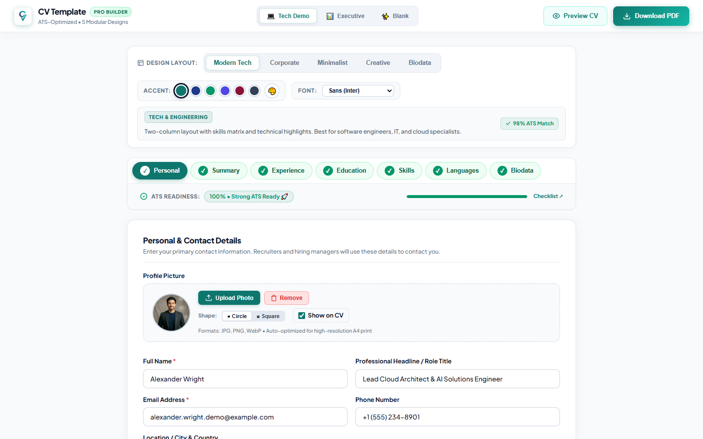
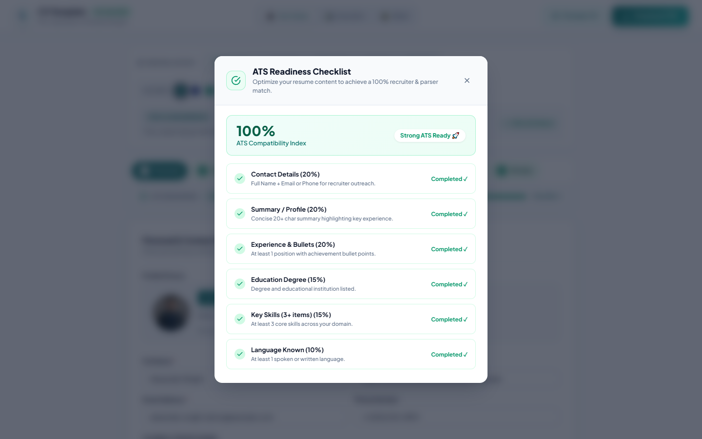
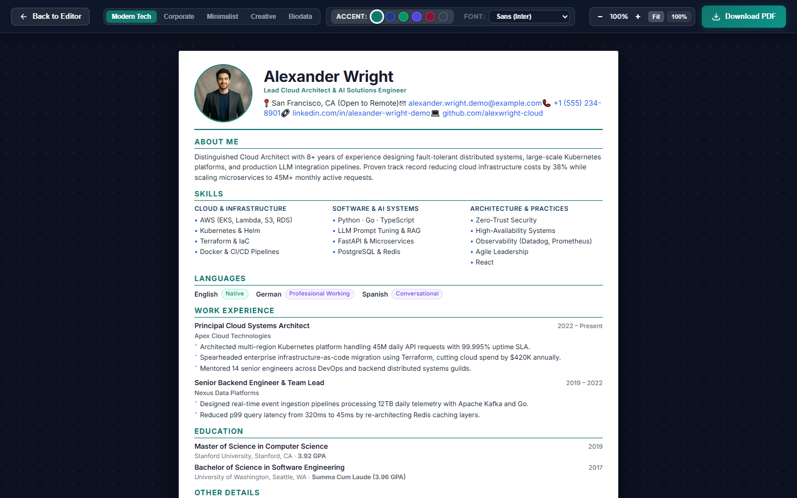
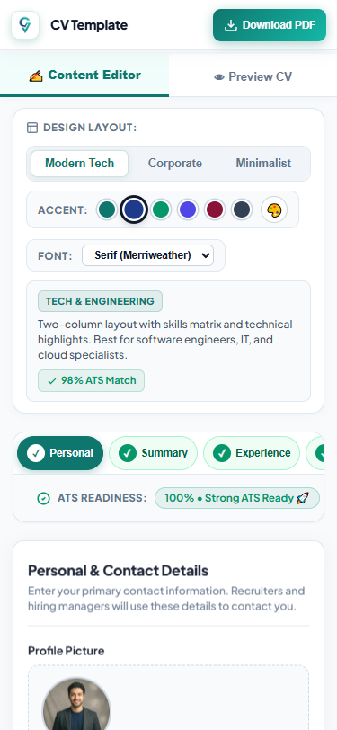
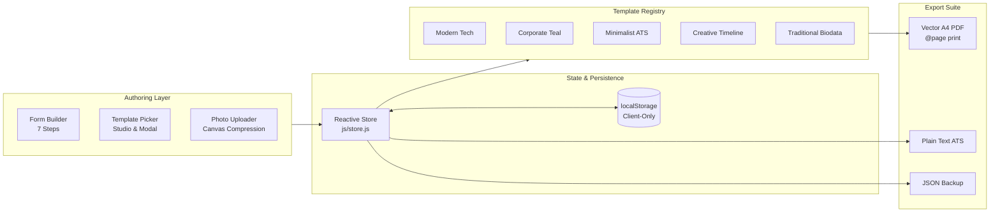

<div align="center">

# 📄 CV Template

### Professional ATS-Optimized Resume & Biodata Studio

A lightweight, zero-dependency, privacy-first client-side document authoring studio.<br/>
Engineered for **100% ATS compatibility**, seamless responsive ergonomics, and **vector-sharp A4 PDF export**.

---

[](LICENSE)
[](https://developer.mozilla.org/en-US/docs/Web/JavaScript)
[](package.json)
[](css/base.css)
[](manifest.json)
[](css/base.css)
[](#-interactive-ats-readiness-index)

</div>

---

## 🌟 Visual Showcase

### 1. Document Authoring Studio
Spacious 960px centered workspace with completed stepper indicators, in-studio layout bar, and interactive ATS readiness gauge:

<p align="center">
  
</p>

---

### 2. Interactive ATS Compatibility Index Modal
Real-time scoring algorithm breaking down recruiter and ATS parser criteria into an actionable checklist:

<p align="center">
  
</p>

---

### 3. Full-Screen Canvas Desk with Live Styling
Full-screen review desk with zoom controls (`Fit`, `75%`, `100%`, `125%`), live layout switching, instant accent swatches, and typography selection:

<p align="center">
  
</p>

---

### 4. Mobile Ergonomics
Clean single-hand mobile experience with segmented view tabs, native preset select, and horizontal scrolling rails:

<p align="center">
  
</p>

---

## 🚀 Key Features

* **5 Distinct ATS-Optimized Templates:**
  - **Modern Tech**: Two-column layout with skills category matrix and technical highlights.
  - **Corporate Executive**: Asymmetric sidebar, leadership highlights, and formal signature block.
  - **Minimalist ATS**: Universal single-column layout engineered for 100% parser pass rates (Workday, Taleo, Greenhouse).
  - **Creative Timeline**: Chronological vertical axis connecting career milestones with indigo accents.
  - **Traditional Biodata**: Formal tabular layout for academic credentials and personal particulars.
* **Dual Design Customizer (In-Studio & In-Preview):**
  - Instant layout switching across all 5 designs without losing filled data.
  - 6 executive accent swatches (*Corporate Teal, Royal Navy, Emerald Green, Indigo Purple, Executive Burgundy, Slate Charcoal*) plus a native color picker.
  - 4 typography engines: Sans (*Inter*), Corporate (*Calibri*), Serif (*Merriweather*), and Code (*JetBrains Mono*).
* **Collapsible Dynamic Cards:**
  - Work Experience and Education cards collapse into concise single-line headers to minimize vertical scrolling fatigue.
* **Interactive ATS Readiness System:**
  - Weighted scoring algorithm calculates resume strength in real time.
  - Clicking the gauge opens an interactive modal with direct status checklists.
* **Vector-Sharp A4 PDF Export:**
  - Native browser vector printing (`window.print()`) calibrated with exact `@page` rules for standard `210mm × 297mm` A4 portrait paper. Zero raster blur and 100% selectable text.
* **100% Privacy & Offline-First PWA:**
  - Zero external server calls. All data remains exclusively within the user's browser via `localStorage`.
  - Service worker caching enables full offline functionality in air-gapped environments.

---

## 📊 Template Comparison Matrix

| Template | Primary Role / Industry | ATS Match | Format | Key Visual Element |
|---|---|---|---|---|
| **Modern Tech** | Software Engineering, DevOps, Cloud | **98%** | 2-Column Grid | Technical Skills Matrix & Status Badges |
| **Corporate Executive** | Directors, Operations, Leadership | **96%** | Asymmetric Sidebar | Career Highlights & Signature Block |
| **Minimalist ATS** | Universal / High-Volume Corporate | **100%** | Single Column | High-Density Linear Parser Text |
| **Creative Timeline** | Designers, Product Managers, Leads | **95%** | Chronological Axis | Vertical Timeline Dots & Milestone Cards |
| **Traditional Biodata** | Academic, Indian Civil & Corporate | **94%** | Tabular Grid | Formal Particulars Table & Marksheet Grid |

---

## 🏗️ Architecture Overview

The system uses a unidirectional reactive architecture centered around an immutable data store:



For complete technical specifications, see [`ARCHITECTURE.md`](ARCHITECTURE.md).

---

## ⚡ Quick Start

Because **CV Template** is built with modern ES Modules and native web standards, **no build step or compilation is required to run**.

### Option A: Local Dev Server with Hot Reload (Recommended)
```bash
# Clone the repository
git clone https://github.com/Rana0Codes/cv-template.git
cd cv-template

# Install dev dependencies (Vite & Puppeteer)
npm install

# Start local dev server
npm run dev
```
Open `http://localhost:5173` in your browser.

### Option B: Python HTTP Server (Zero Install)
```bash
python -m http.server 8000
```
Open `http://localhost:8000` in your browser.

### Option C: VS Code Live Server
Right-click `index.html` and select **"Open with Live Server"**.

---

## 🧪 Automated Testing & Verification

```bash
# Verify JavaScript syntax across all modules
npm run check

# Test Vite production bundle build
npm run build

# Run automated browser E2E verification suite
npm test

# Run automated vector A4 PDF export test
npm run test:pdf
```

---

## ⌨️ Productivity & Keyboard Shortcuts

| Shortcut | Context | Action |
|---|---|---|
| <kbd>Esc</kbd> | Global | Close full-screen preview modal or ATS checklist modal |
| <kbd>Ctrl</kbd> + <kbd>P</kbd> / <kbd>Cmd</kbd> + <kbd>P</kbd> | Global | Open full-screen preview and trigger vector A4 PDF print dialog |
| <kbd>Tab</kbd> / <kbd>Shift</kbd> + <kbd>Tab</kbd> | Editor | Natural accessibility-compliant focus navigation across inputs |

---

## 🌐 Browser Compatibility

| Browser | Minimum Version | Status |
|---|---|---|
| **Google Chrome** | 88+ | Full Support |
| **Microsoft Edge** | 88+ | Full Support |
| **Mozilla Firefox** | 85+ | Full Support |
| **Apple Safari** | 14+ | Full Support |

---

## 📁 Repository Structure

```text
cv-template/
├── .github/
│   ├── workflows/
│   │   ├── ci.yml                # Automated syntax check & build verification
│   │   └── deploy.yml            # Automated GitHub Pages deployment
│   ├── ISSUE_TEMPLATE/
│   │   ├── bug_report.md         # Structured bug reporting template
│   │   └── feature_request.md    # Template for layout and feature suggestions
│   └── PULL_REQUEST_TEMPLATE.md  # Standard pull request checklist
│
├── assets/                       # Brand icons, logo, and synthetic demo avatars
├── css/
│   ├── base.css                  # Tokens, typography, header, modals, toasts
│   ├── editor.css                # 7-step editor, collapsible cards, ATS bar
│   ├── preview.css               # Full-screen canvas desk, live customizer
│   ├── print.css                 # Vector A4 @page print stylesheet
│   └── templates/                # Individual stylesheets for templates 1–5
│
├── docs/
│   └── images/                   # High-resolution showcase screenshots
│
├── js/
│   ├── app.js                    # Application orchestrator and event binding
│   ├── store.js                  # Reactive state store & localStorage sync
│   ├── defaults.js               # Synthetic demo personas (Zero PII)
│   ├── export/                   # Vector PDF, plain text ATS, JSON exporters
│   ├── templates/                # Modular HTML template renderers 1–5
│   └── ui/                       # Form builder, photo uploader, styler, icons
│
├── tests/
│   ├── verify-suite.js           # Automated E2E & minimal data test suite
│   └── pdf-export.js             # Automated vector PDF export test runner
│
├── ARCHITECTURE.md               # Deep-dive system architecture documentation
├── CODE_OF_CONDUCT.md            # Contributor Covenant v2.1
├── CONTRIBUTING.md               # Contributor guide & coding standards
├── LICENSE                       # MIT License
├── README.md                     # Project landing page & documentation
├── SECURITY.md                   # Security & privacy policy
├── index.html                    # Application HTML shell
├── manifest.json                 # PWA Web App manifest
├── package.json                  # Project manifest & npm scripts
└── sw.js                         # PWA offline-first service worker
```

---

## 🔒 Privacy Guarantee

* **Zero Cloud Storage**: All CV data is stored locally in your browser's `localStorage`.
* **Zero Telemetry**: No tracking scripts, analytics cookies, or external beacons.
* **Air-Gapped Operation**: Functions 100% offline via Service Worker caching.

---

## 🤝 Contributing

Contributions are welcome! Please read our [Contributing Guidelines](CONTRIBUTING.md) and [Code of Conduct](CODE_OF_CONDUCT.md) before submitting pull requests.

---

## 📄 License

This project is licensed under the **MIT License** — see the [LICENSE](LICENSE) file for details.
